# Keyword detection with Edge Impulse and Thingy:53
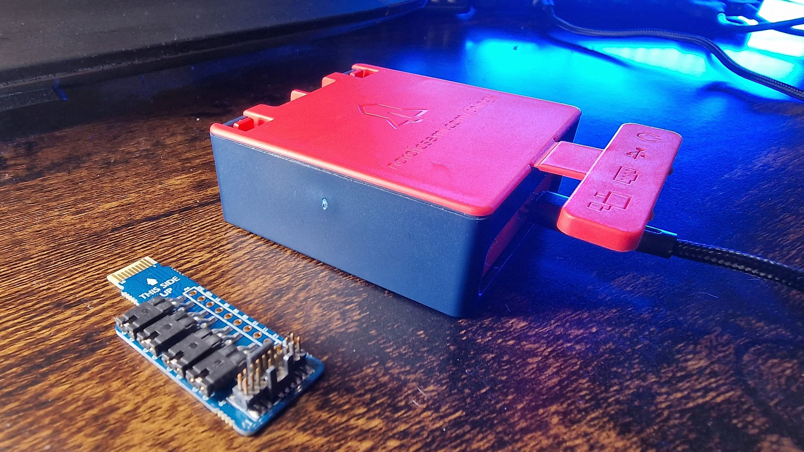

Project by [Adam Milton-Barker](https://www.AdamMiltonBarker.com)
Github project [Keyword detection with Edge Impulse and Thingy:53](https://github.com/AdamMiltonBarker/edge-impulse-thingy-53-keyword-detection)

# Introduction

The Nordic Thingy:53™ is a user-friendly IoT prototyping platform designed for easy creation of prototypes and proofs-of-concept without requiring custom hardware development. It utilizes the nRF5340 SoC, featuring dual-core Arm Cortex-M33 processors with ample processing power and memory capacity for running embedded machine learning models directly on the device.

Through the nRF Edge Impulse app, users can seamlessly connect their Nordic Thingy:53 to their Edge Impulse studio account via a mobile device. This facilitates wireless transfer of sensor data to the mobile device via Bluetooth LE, enabling data upload to the cloud for training and downloading trained ML models for deployment and inference. Additionally, the app serves as a graphical interface for monitoring the results of running ML models.

The Thingy:53's Bluetooth Low Energy radio supports various protocols, including Bluetooth mesh, Thread, Zigbee, and proprietary 2.4 GHz protocols, making it suitable for Matter ecosystem development, which standardizes connected home applications using IP as the network layer.

# Project

This project will take you through the process of creating a custom AI model with the Edge Impulse platform capable of detecting the keywords `Go` and `Stop`, and deploying it to the `Thingy:53` software board.

## Hardware

- Thingy:53 [Buy](https://www.nordicsemi.com/Products/Development-hardware/Nordic-Thingy-53)

## Platform

-  Edge Impulse [Visit](https://www.edgeimpulse.com)

## Software

- Edge Impulse CLI [Download](https://docs.edgeimpulse.com/docs/edge-impulse-cli/cli-installation)
- nRF Connect (Version 4.1.1) [Download](https://www.nordicsemi.com/Products/Development-tools/nRF-Connect-for-Desktop/Download#infotabs)

## Project Setup

Head to [Edge Impulse](https://www.edgeimpulse.com) and create your account or login.

### Install Dependencies
You need to install the Edge Impulse CLI and nRF Connect:

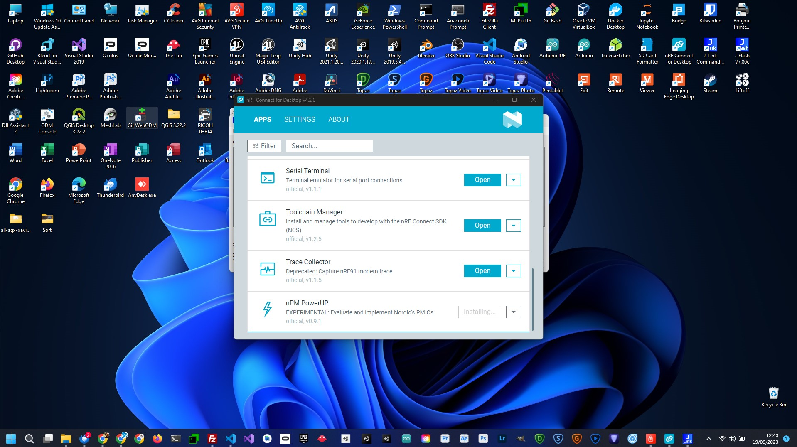

- [Edge Impulse CLI](https://docs.edgeimpulse.com/docs/edge-impulse-cli/cli-installation)
- [nRF Connect](https://www.nordicsemi.com/Products/Development-tools/nrf-connect-for-desktop)

### Create New Project
From the project selection/creation section you can create a new project.

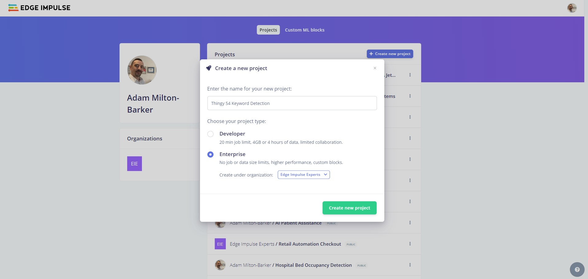

Enter a **project name**, select **Developer** or **Enterprise** and click **Create new project**.

### Connect Your Device

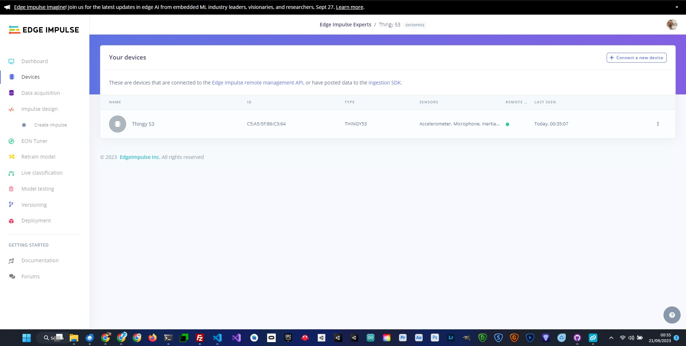

Now we will connect your device to the Edge Impulse platform. To get started connect your device to your computer using a USB cable. If this is the first time you are using your Thingy:53 you can go straight ahead and connect your device to your computer and fire up the Edge Impulse daemon. If you have already flashed other firmware onto your device follow [these steps](https://docs.edgeimpulse.com/docs/development-platforms/officially-supported-mcu-targets/nordic-semi-thingy53#updating-the-firmware).

Once you are ready open up command prompt or terminal and start the Edge Impulse daemon.

```edge-impulse-daemon```

If you are already connected to an Edge Impulse project, use the following command:

```edge-impulse-daemon --clean```

You will be asked to log in to your Edge Impulse account and then select the COM port that your device is connected to.

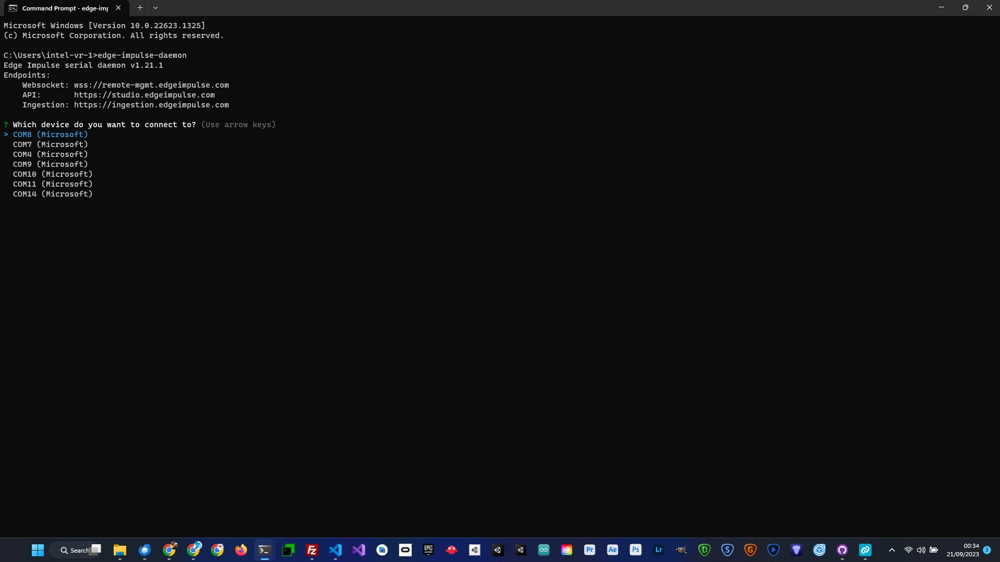

## Data Acquisition

Now comes the fun part. We are going to create our own keyword dataset using the built in microphone on the Thingy:53. This data will allow us to train an AI model that is capable of identifying when we say **Go** and **Stop**.

We will use the **Record new data** feature on Edge Impulse to record 15 sets of 15 utterences of each of our keywords, and then we will split them into individual samples. Ensuring your device is connected to the Edge Impulse platform, head over to the **Data Aqcquisition**.

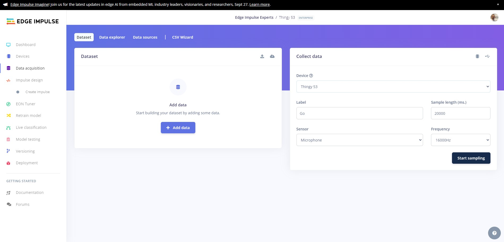

Select your device then select **Built in microphone**, set the label as **Go**, change the sample length to 20000 (20 seconds), and leave all the other settings as is. Make sure the microphone is close to you, click **Start sampling** and record yourself saying **Go** 15 times.

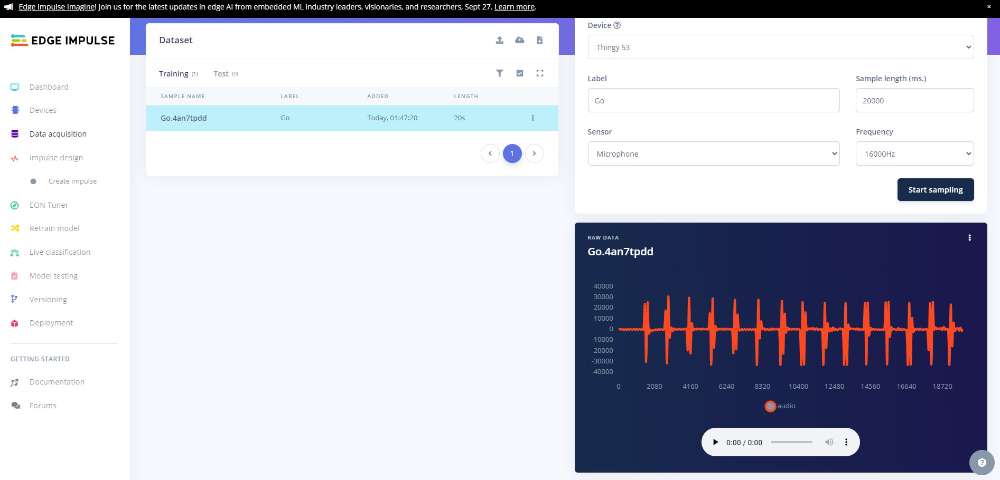

You will now see the uploaded data in the **Collected data** window, next we need to split the data into ten individual samples. Click on the dots to the right of the sample and click on **Split sample**, this will bring up the sample split tool. Here you can move the windows until each of your samples are safely in a window. You can fine tune the splits by dragging the windows until you are happy, then click on **Split**

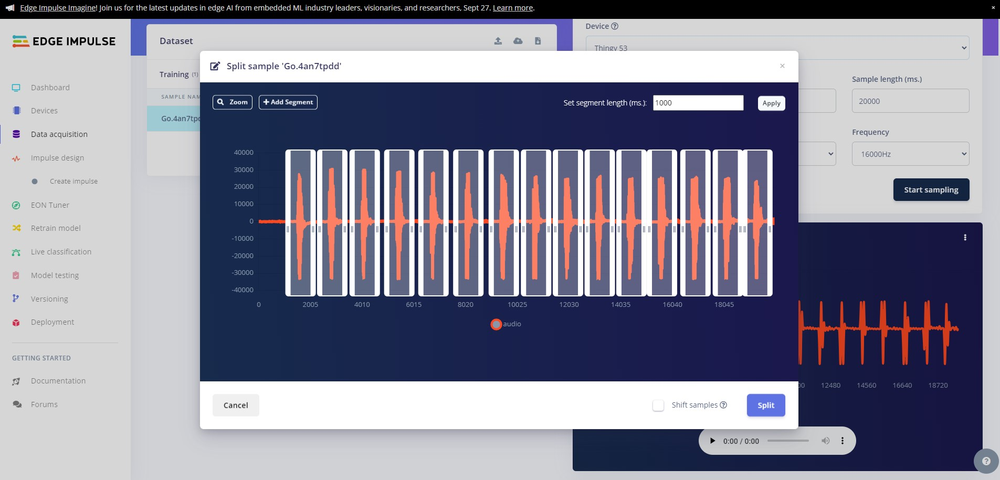

You will see all of your samples now populated in the **Dataset** window.

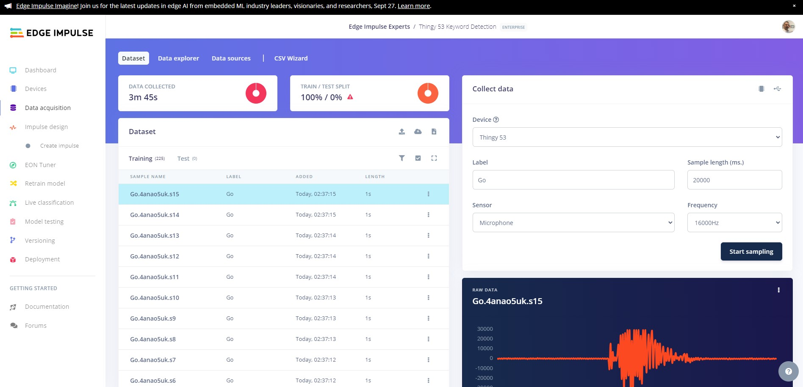

Now you need to repeat this action 14 more times for the **Go** class, resulting in 225 samples for the Go class. Once you have finished, repeat this for the remaining **Stop** class. You will end up with a dataset of 450 samples, 225 per class.

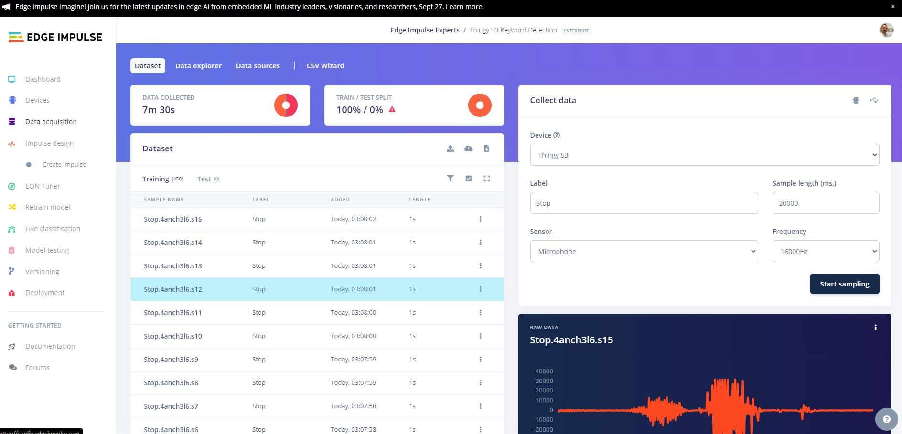

After we finish recording and splitting, we still need a little more data. We need a **Noise** class that will help our model determine when nothing is being said, and we need an **Unknown** class, for things that our model may come up against that are not in the dataset.

For the noise class record 75 samples with no speaking and label them as **Noise**.

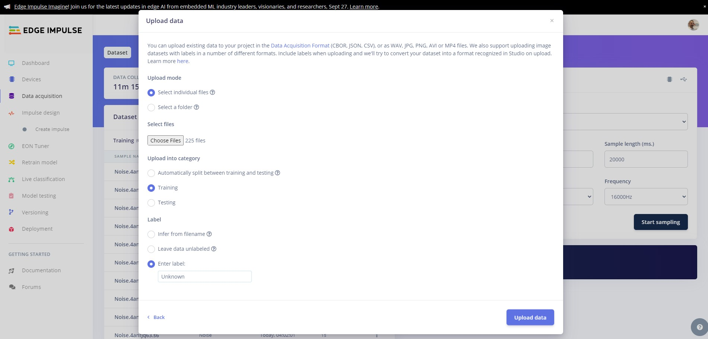

Next download the [Edge Impulse keywords dataset](https://cdn.edgeimpulse.com/datasets/keywords2.zip) and extract the data. Copy 150 samples from the **Noise** folder and upload to the Edge Impulse platform by going to the **Data Acquisition** tab and uploading the new data, then copy 225 samples from the unknown class and  into the **Unknown** class.

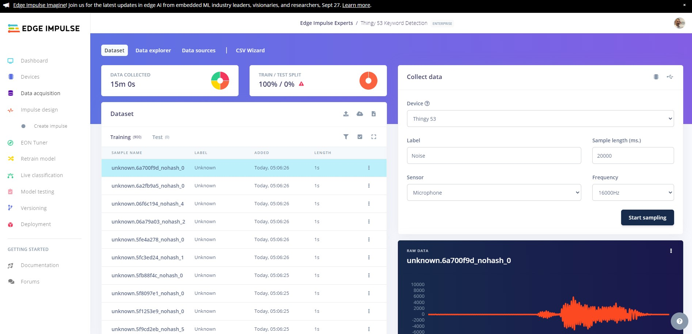

You should now have 900 samples in your training data.

### Split Dataset

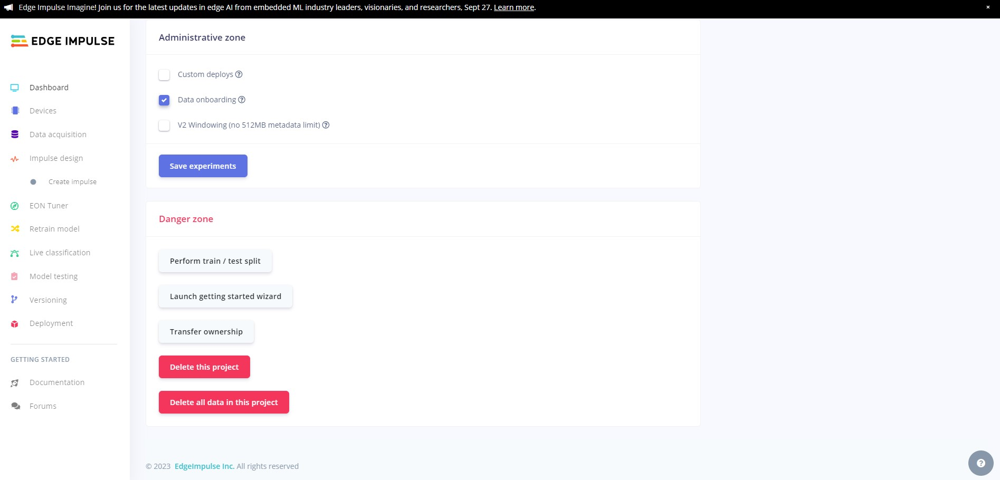

We need to split the dataset into test and training samples. To do this head to the dashboard and scroll to the bottom of the page, then click on the **Perform train/test split**

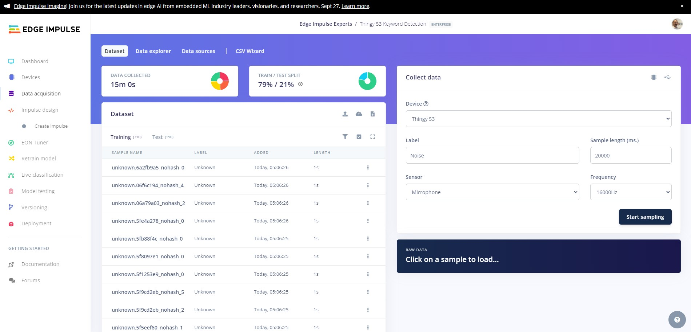

Once you have done this, head back to the data acquisition tab and you will see that your data has been split.

## Create Impulse

Now we are going to create our network and train our model.

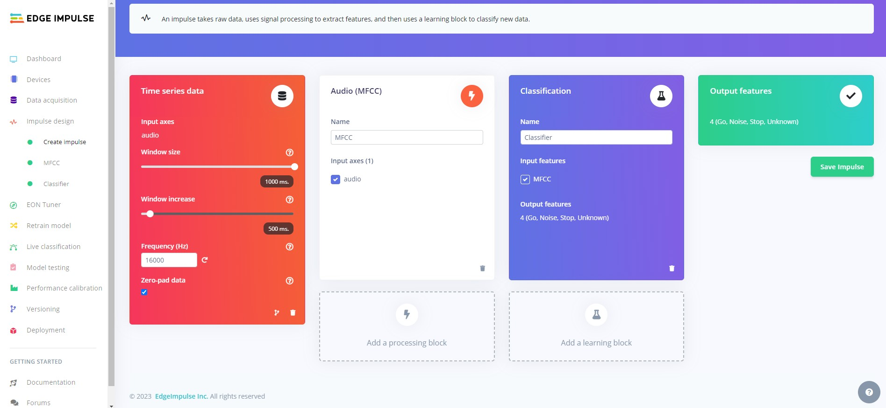

Head to the **Create Impulse** tab and click **Add processing block** then select **Audio (MFCC)**, then click **Add learning block** and select **Classifier**. Now click **Save impulse**.

### MFCC Block

#### Parameters

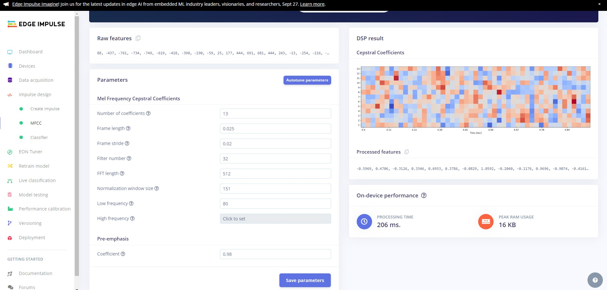

Head over to the **MFCC** tab and click on **Autotune parameters** and then **Save parameters** to save the MFCC block parameters.

#### Generate Features

If you are not automatically redirected to the **Generate features** tab, click on the **MFCC** tab and then click on **Generate features** and finally click on the **Generate features** button.

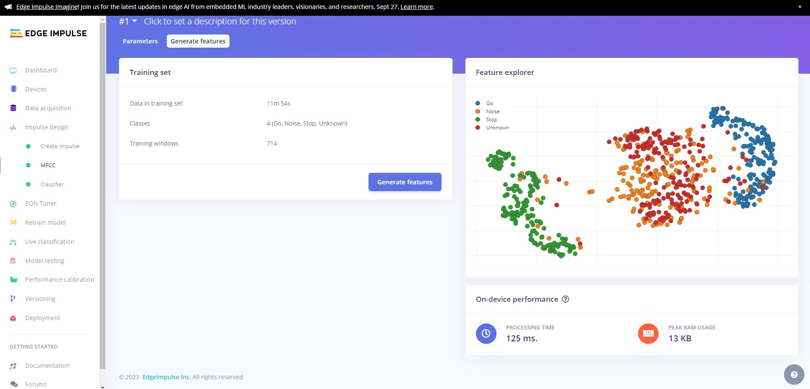

Ideally your data will be nicely clustered with minimal mixing of the classes.

## Training

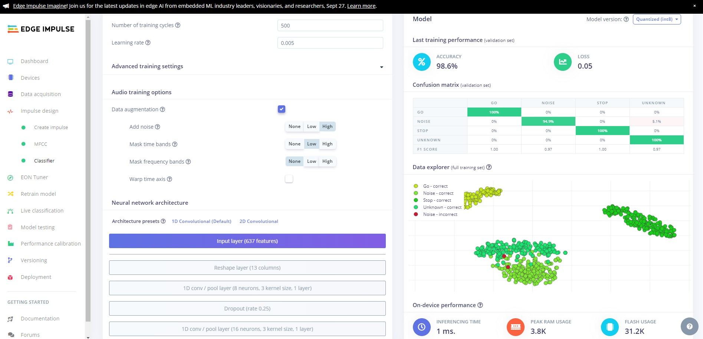

Now we are going to train our model. Click on the **Transfer Learning (Keyword Spotting)** tab then click **Start training**.

Once training has completed, you will see the results displayed at the bottom of the page. Here we see that we have 98.6% accuracy. Lets test our model and see how it works on our test data.

## Testing

### Platform Testing

Head over to the **Model testing** tab where you will see all of the unseen test data available. Click on the **Classify all** and sit back as we test our model.

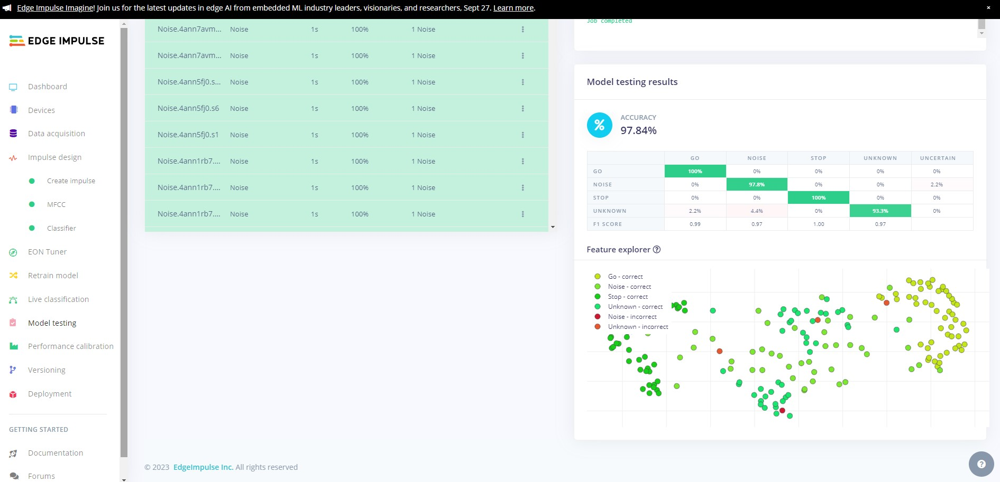

You will see the output of the testing in the output window, and once testing is complete you will see the results. In our case we can see that we have achieved 97.84% accuracy on the unseen data, and a high F-Score on all classes.

### On Device Testing

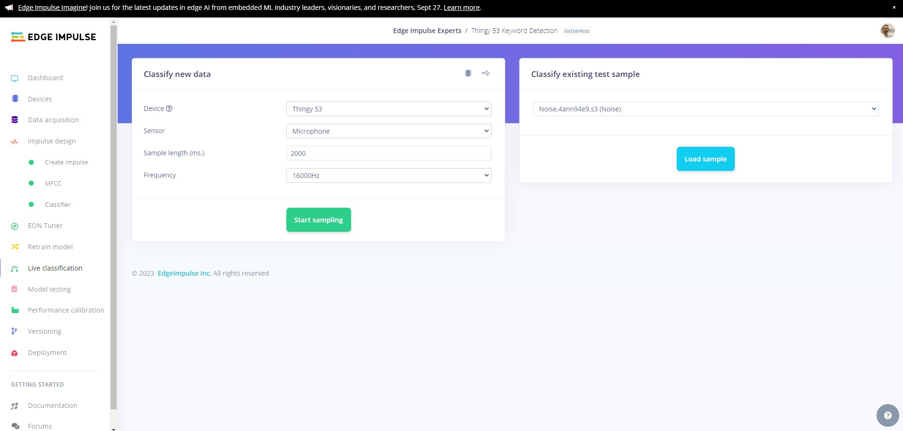

Now we need to test how the model works on our device. Use the **Live classification** feature to record some samples for clasification. Your model should correctly identify the class for each sample.


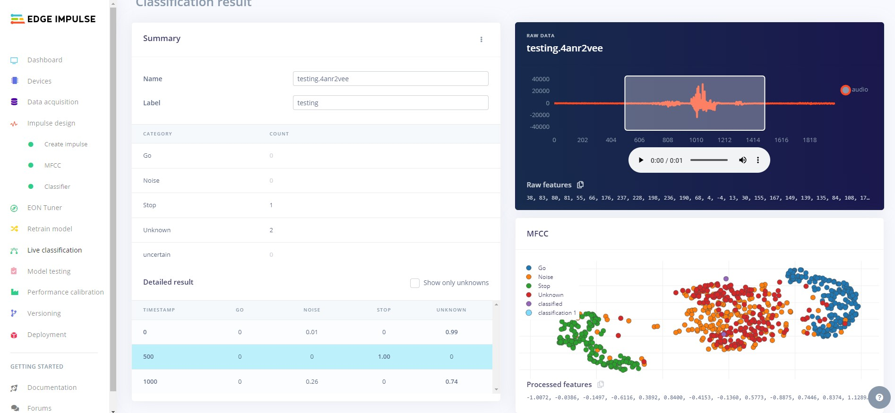

In our case, the model classifies well, correctly identifying each keyword each time.

## Deployment

There are two ways to deploy your project to your Thingy:53. This tutorial will cover both.

### nRF Connect for Desktop

To deploy your model using the nRF Desktop programmer you must have installed  [nRF Connect version 4.1.1](https://www.nordicsemi.com/Products/Development-tools/nRF-Connect-for-Desktop/Download#infotabs) and installed version 3.0.8 of the Programmer. At the time of writing this tutorial there is a bug with the latest versions and you will not be able to deploy your program using them.

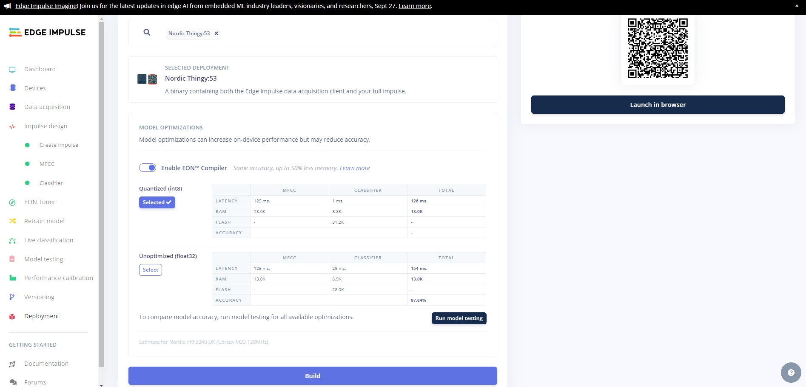

Head over to the deployment tab and select `Nordic Thingy:53` for your selected deployment then head to the bottom of the page and click `Build`. Once the project is built you will be able to download the binary to a location of your choice. The required files will be zipped into a compressed folder. Save the zip to a location of your choice.

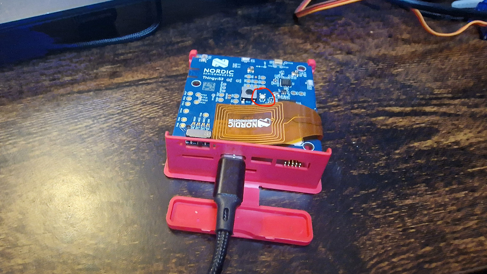

To flash the Thingy:53 with the programmer you need to first set the board into `bootloader mode`. To do so you need to turn off the board with the `SW1` switch, and then hold down the `SW2` button (shown on the photo above) whilst turning the device back on with the `SW1` switch.

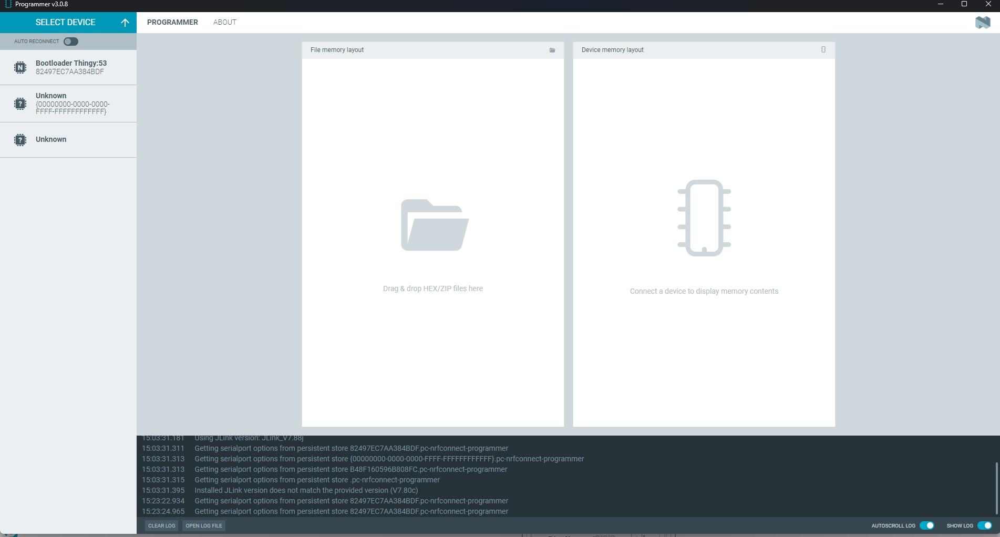

Click on the tab that says `Bootloader Thingy:53` and then click on `Add file`. This will open up a file explorer and you can navigate to the zip folder you downloaded from the Edge Impulse platform.

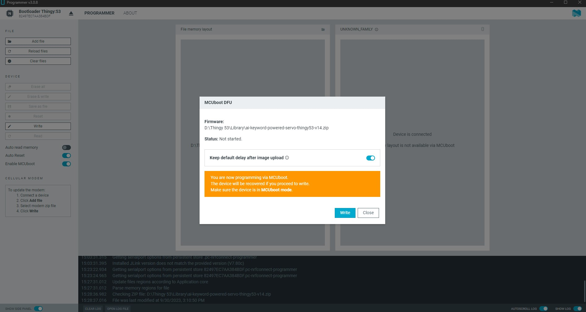

Once you have selected the zip, click on the `Write` button.

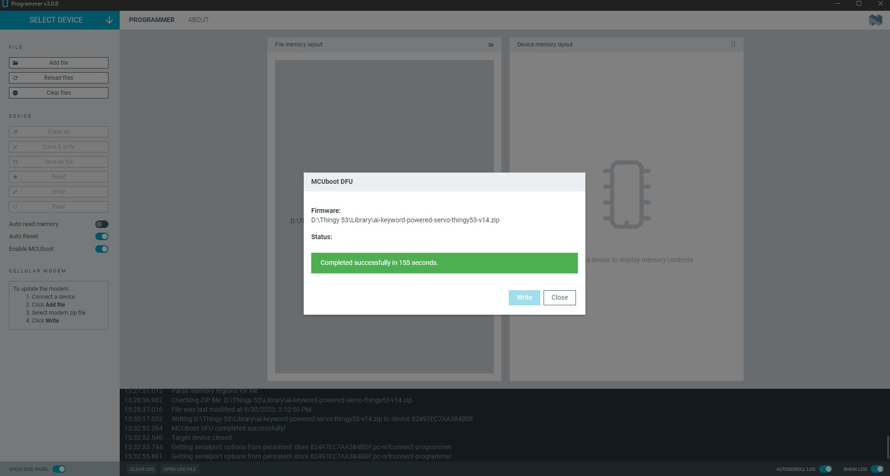

Wait for the programmer to complete and your program will now be installed on your Thingy:53.

### Nordic nRF Edge Impulse App

Download the Nordic nRF Edge Impulse app ( [Android](https://play.google.com/store/apps/details?id=no.nordicsemi.android.nrfei) / [iOS](https://apps.apple.com/us/app/nrf-edge-impulse/id1557234087) ) Once you have downloaded the app, open the app and sign into your Edge Impulse account.

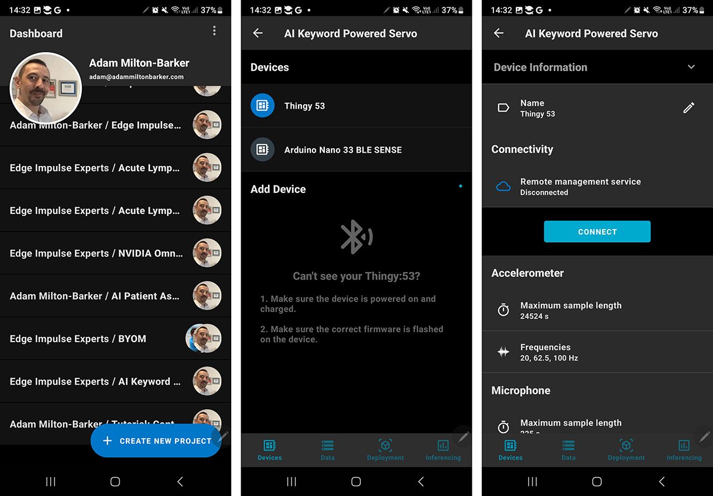

Once you are logged in you will be shown your Edge Impulse projects. Select your Thingy:53 project and you will be taken to a tab that shows your connected devices. Choose the Thingy:53 board and then click `Connect`.

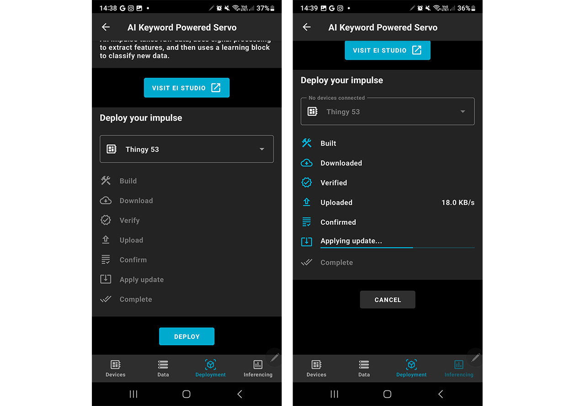

Once connected to your device, head over to the `Deployment` tab, scroll to the bottom and hit `Deploy`. This will then deploy your project to your Thingy:53.

## Inference

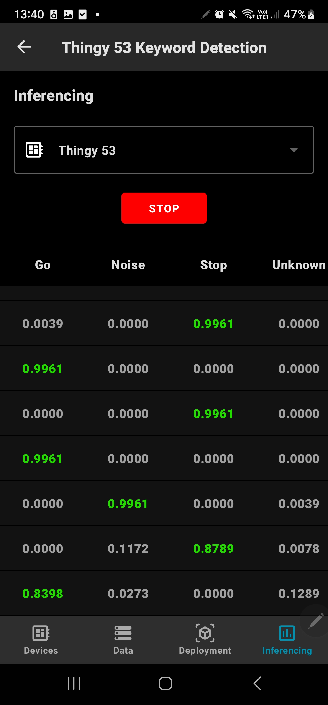

Now that you have your device deployed to your Thingy:53, we can use the `Inferencing` tab of the `Nordic nRF Edge Impulse App` to communicate with the device. Open up the app and go to your project, ensure your Thingy:53 is connected  then head to the `Inferencing` tab and click `Start`, you will see that the app starts to listen for keywords. When you don't say anything the classifications should either be `Noise` or `Unknown`, when you say `Go` or `Stop` the app will detect they keywords and show the results to you.

# Conclusion

In conclusion, this project highlights the ease and effectiveness of the Edge Impulse platform in developing and deploying advanced AI models. Our successful deployment of a keyword recognition model on the resource-constrained Thingy:53 development board underscores Edge Impulse's capability to bring AI to edge devices, making it accessible and efficient for a wide range of applications. This project exemplifies the future of AI development and deployment in the IoT landscape, opening up new possibilities for innovation.